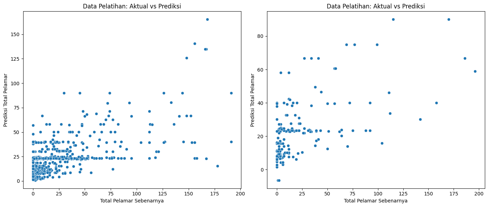
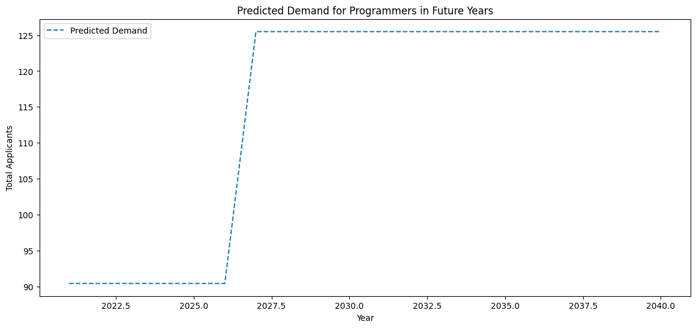

## Prediksi Permintaan Programmer Menggunakan Gradient Boosting

### Pendahuluan
Dalam contoh ini, kita akan memprediksi permintaan programmer di masa depan menggunakan model Gradient Boosting. Dataset yang digunakan mencakup berbagai fitur seperti jumlah pengikut LinkedIn, jumlah karyawan, dan keterampilan teknis yang dimiliki oleh kandidat.

### Langkah-Langkah

#### 1. Muat dan Persiapkan Data
Pertama, kita memuat dataset dari file CSV dan memilih fitur yang relevan untuk model.

```python
import numpy as np
import pandas as pd
from sklearn.model_selection import train_test_split
from sklearn.preprocessing import StandardScaler
from sklearn.ensemble import GradientBoostingRegressor
from sklearn.metrics import mean_squared_error
import matplotlib.pyplot as plt
import seaborn as sns

data = pd.read_csv('your_dataset.csv')

features = ['LinkedIn_Followers', 'Employee_count', 'PYTHON', 'C++', 'JAVA', 'HADOOP', 'SCALA', 'FLASK', 'PANDAS', 'SPARK', 'NUMPY', 'PHP', 'SQL', 'MYSQL', 'CSS', 'MONGODB', 'NLTK', 'TENSORFLOW', 'LINUX', 'RUBY', 'JAVASCRIPT', 'DJANGO', 'REACT', 'REACTJS', 'AI', 'UI', 'TABLEAU', 'NODEJS', 'EXCEL', 'POWER BI', 'SELENIUM', 'HTML', 'ML']

target = 'Total_applicants'
```

#### 2. Pisahkan Data Pelatihan dan Pengujian
Kita memisahkan data menjadi set pelatihan dan pengujian, lalu menskalakan fitur-fitur tersebut.

```python
X = data[features]
y = data[target]

X_train, X_test, y_train, y_test = train_test_split(X, y, test_size=0.2, random_state=42)

scaler = StandardScaler()
X_train = scaler.fit_transform(X_train)
X_test = scaler.transform(X_test)
```

#### 3. Latih Model Gradient Boosting
Kami melatih model Gradient Boosting dan membuat prediksi untuk data pelatihan dan pengujian.

```python
model = GradientBoostingRegressor(n_estimators=100, learning_rate=0.1, max_depth=3, random_state=42)
model.fit(X_train, y_train)

y_train_pred = model.predict(X_train)
y_test_pred = model.predict(X_test)
```

#### 4. Evaluasi Model
Kami mengevaluasi kinerja model menggunakan Mean Squared Error (MSE) dan memvisualisasikan hasil prediksi.

```python
train_mse = mean_squared_error(y_train, y_train_pred)
test_mse = mean_squared_error(y_test, y_test_pred)

print(f'Training MSE: {train_mse}')
print(f'Testing MSE: {test_mse}')

plt.figure(figsize=(14, 6))

plt.subplot(1, 2, 1)
sns.scatterplot(x=y_train, y=y_train_pred)
plt.xlabel('Actual Total Applicants')
plt.ylabel('Predicted Total Applicants')
plt.title('Training Data: Actual vs Predicted')

plt.subplot(1, 2, 2)
sns.scatterplot(x=y_test, y=y_test_pred)
plt.xlabel('Actual Total Applicants')
plt.ylabel('Predicted Total Applicants')
plt.title('Testing Data: Actual vs Predicted')

plt.tight_layout()
plt.show()
```

#### 5. Prediksi Permintaan di Masa Depan
Kami membuat prediksi permintaan untuk 20 tahun ke depan dengan memperkirakan kenaikan tahunan untuk beberapa fitur.

```python
num_future_years = 20

future_data = pd.DataFrame.from_records([])

for year in range(2021, 2021 + num_future_years):
    future_data_dict = {
        'LinkedIn_Followers': 7000000 * (1 + 0.05 * (year - 2020)),  # Asumsi: Naik 5% setiap tahun
        'Employee_count': 10001 * (1 + 0.02 * (year - 2020)),  # Asumsi: Naik 2% setiap tahun
        'PYTHON': 1,  # Kemungkinan tetap
        'C++': 0,  # Kemungkinan tetap
        'JAVA': 1,  # Kemungkinan tetap
        'HADOOP': 0,  # Kemungkinan tetap
        'SCALA': 0,  # Kemungkinan tetap
        'FLASK': 1,  # Kemungkinan tetap
        'PANDAS': 1,  # Kemungkinan tetap
        'SPARK': 0,  # Kemungkinan tetap
        'NUMPY': 1,  # Kemungkinan tetap
        'PHP': 0,  # Kemungkinan tetap
        'SQL': 1,  # Kemungkinan tetap
        'MYSQL': 0,  # Kemungkinan tetap
        'CSS': 0,  # Kemungkinan tetap
        'MONGODB': 0,  # Kemungkinan tetap
        'NLTK': 0,  # Kemungkinan tetap
        'TENSORFLOW': 0,  # Kemungkinan tetap
        'LINUX': 1,  # Kemungkinan tetap
        'RUBY': 0,  # Kemungkinan tetap
        'JAVASCRIPT': 1,  # Kemungkinan tetap
        'DJANGO': 1,  # Kemungkinan tetap
        'REACT': 1,  # Kemungkinan tetap
        'REACTJS': 0,  # Kemungkinan tetap
        'AI': 1,  # Kemungkinan tetap
        'UI': 1,  # Kemungkinan tetap
        'TABLEAU': 0,  # Kemungkinan tetap
        'NODEJS': 1,  # Kemungkinan tetap
        'EXCEL': 1,  # Kemungkinan tetap
        'POWER BI': 1,  # Kemungkinan tetap
        'SELENIUM': 0,  # Kemungkinan tetap
        'HTML': 1,  # Kemungkinan tetap
        'ML': 1  # Kemungkinan tetap
    }
    future_data = pd.concat([future_data, pd.DataFrame([future_data_dict])], ignore_index=True)

future_data_scaled = scaler.transform(future_data)

future_demand_pred = model.predict(future_data_scaled)

years = np.arange(2021, 2021 + num_future_years)

plt.figure(figsize=(14, 6))
plt.plot(years, future_demand_pred, label='Predicted Demand', linestyle='--')
plt.xlabel('Year')
plt.ylabel('Total Applicants')
plt.title('Predicted Demand for Programmers in Future Years')
plt.legend()
plt.show()
```

### Hasil



### Kesimpulan
Dalam contoh ini, kita telah membangun model Gradient Boosting untuk memprediksi permintaan programmer berdasarkan berbagai fitur. Kami juga memprediksi permintaan di masa depan dengan asumsi peningkatan tahunan pada beberapa fitur. Asumsi-asumsi ini harus disesuaikan berdasarkan data nyata atau analisis yang lebih mendalam.